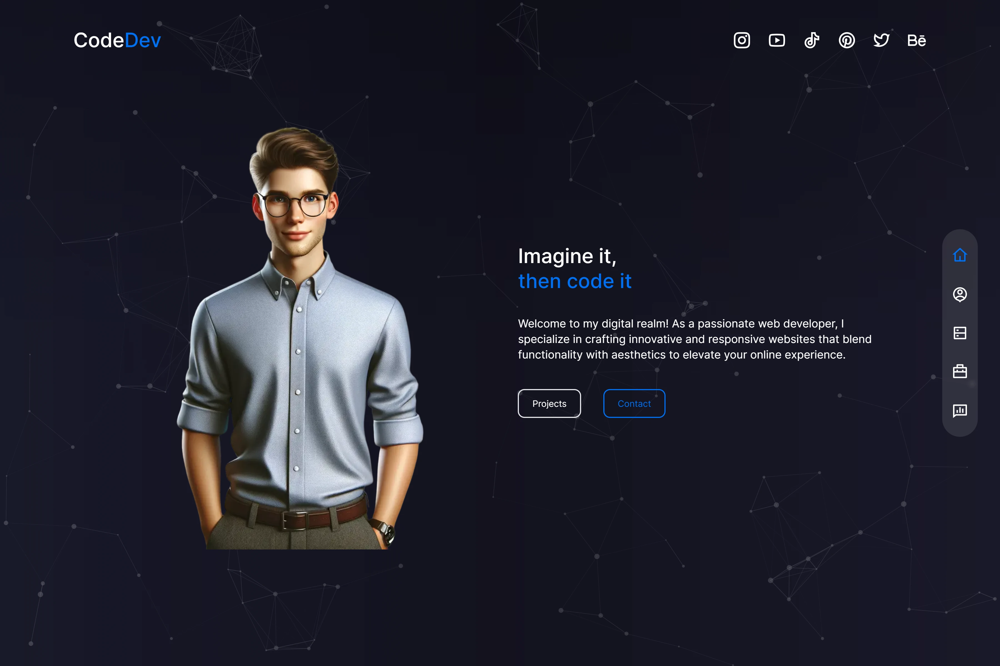

<div align='center'>

[![demo][demo]][demo-link]
[![status][status]][status-link]
[![deploy][deploy]][deploy-link]
[![test][tests]][tests-link]

</div>

<div align='center'>
  <a href='/'>
    
  </a>
</div>

<div align='center'>
  <h1>Portfolio Web with Next.js</h1>
</div>

<div align='center'>

[![Next.js][nextjs]][nextjs-link]
[![TypeScript][typescript]][typescript-link]
[![Tailwind CSS][tailwindcss]][tailwindcss-link]
[![React][react]][react-link]
[![Framer Motion][framer-motion]][framer-motion-link]
[![GSAP][gsap]][gsap-link]
[![Swiper][swiper]][swiper-link]
[![React CountUp][react-countup]][react-countup-link]
[![React Icons][react-icons]][react-icons-link]
[![Vercel][vercel]][vercel-link]

</div>

<div align='center'>
  A terminal-themed portfolio website built with Next.js 16, React 19, TypeScript, and Tailwind CSS. Features a GSAP-powered interactive dot grid background, CRT scanline and flicker effects, smooth page transitions, project galleries, service listings, customer testimonials, and a contact form.

[Demo][demo-link] · [Report issue](/issues) · [Suggest something](/issues)

</div>

## Table of Contents

- [Table of Contents](#table-of-contents)
- [Features](#features)
- [Tech Stack](#tech-stack)
- [Getting Started](#getting-started)
  - [Prerequisites](#prerequisites)
  - [Installation](#installation)
  - [Running locally](#running-locally)
  - [Build](#build)
  - [Linting](#linting)
- [Environment Variables](#environment-variables)
- [Project Structure](#project-structure)
- [Demo](#demo)
- [Contributing](#contributing)
- [License](#license)

## Features

- [x] Terminal/CRT visual theme with a neon phosphor palette and glow shadows
- [x] Interactive GSAP dot grid background that reacts to cursor proximity with inertia-driven shockwaves
- [x] CSS keyframe effects for scanline, flicker, blink, and marquee animations
- [x] Smooth page transitions and scroll-reveal animations with Framer Motion
- [x] Typewriter hero headline with a looping marquee word strip
- [x] Multi-page App Router navigation (home, about, services, projects, customers, contacts)
- [x] Fixed side rail navigation with `$ cd` command tooltips and active-route highlighting
- [x] Project gallery with expandable hover cards and scroll-driven card selection on mobile
- [x] Responsive services grid with staggered per-card animations
- [x] Customer testimonials carousel powered by Swiper with pagination and navigation
- [x] Animated stat counters (experience, customers, projects, awards) with React CountUp
- [x] Tabbed about section covering skills, experience, education, and awards
- [x] Contact form with name, email, and message fields
- [x] Monospace typography with JetBrains Mono and VT323 loaded through `next/font`
- [x] Responsive design with Tailwind CSS, deployed on Vercel

## Tech Stack

- [Next.js 16](https://nextjs.org/)
- [React 19](https://react.dev/)
- [TypeScript](https://www.typescriptlang.org/)
- [Tailwind CSS](https://tailwindcss.com/)
- [Framer Motion](https://motion.dev/)
- [GSAP](https://gsap.com/)
- [Swiper](https://swiperjs.com/)
- [React CountUp](https://www.npmjs.com/package/react-countup)
- [React Icons](https://react-icons.github.io/react-icons/)
- [Vercel](https://vercel.com/)

## Getting Started

### Prerequisites

- Node.js 20.9+
- npm

### Installation

```bash
git clone https://github.com/wrujel/portfolio-web-template.git
cd portfolio-web-template
npm install
```

### Running locally

```bash
npm run dev
```

Open [http://localhost:3000](http://localhost:3000) with your browser to see the result.

### Build

```bash
npm run build
```

Then serve the production build with:

```bash
npm run start
```

### Linting

```bash
npm run lint
```

## Environment Variables

This project does not require any environment variables for basic usage.

## Project Structure

```
/
├── public/
│   ├── assets/
│   │   ├── avatar.png
│   │   ├── about.png
│   │   ├── avatar_with_tablet.png
│   │   ├── project-1.png ... project-5.png
│   │   └── review-1.jpg ... review-5.jpg
│   ├── next.svg
│   ├── screenshot.png
│   └── vercel.svg
├── src/
│   ├── app/
│   │   ├── layout.tsx
│   │   ├── page.tsx
│   │   ├── globals.css
│   │   ├── favicon.ico
│   │   ├── about/
│   │   ├── contacts/
│   │   ├── customers/
│   │   ├── projects/
│   │   └── services/
│   ├── components/
│   │   ├── About/
│   │   ├── Avatar/
│   │   ├── Contact/
│   │   ├── Cover/
│   │   ├── Customers/
│   │   ├── Header/
│   │   ├── ImageContainer/
│   │   ├── Introduction/
│   │   ├── Navbar/
│   │   ├── Projects/
│   │   ├── Services/
│   │   ├── Transition/
│   │   └── ui/
│   │       └── DotGrid.tsx
│   └── utils/
│       └── motionTransition.ts
├── eslint.config.mjs
├── next.config.js
├── postcss.config.js
├── tailwind.config.ts
├── tsconfig.json
└── package.json
```

## Demo

You can check out the demo:

[![Demo][demo]][demo-link]

## Contributing

Contributions are welcome! If you have suggestions or find bugs, please open an issue or submit a pull request.

1. Fork the repository
2. Create your feature branch (`git checkout -b feature/amazing-feature`)
3. Commit your changes (`git commit -m 'Add some amazing feature'`)
4. Push to the branch (`git push origin feature/amazing-feature`)
5. Open a Pull Request

## License

This project is licensed under the [MIT License](LICENSE).

---

<!-- Badges -->

[nextjs]: https://img.shields.io/badge/Next.js-black?style=for-the-badge&logo=next.js
[typescript]: https://img.shields.io/badge/Typescript-007ACC?style=for-the-badge&logo=typescript&logoColor=white&color=blue
[tailwindcss]: https://img.shields.io/badge/Tailwind%20CSS-38B2AC?style=for-the-badge&logo=tailwind-css&logoColor=white
[react]: https://img.shields.io/badge/React-20232A?style=for-the-badge&logo=react&logoColor=61DAFB
[framer-motion]: https://img.shields.io/badge/Framer%20Motion-2A2A2A?style=for-the-badge&logo=npm&logoColor=white
[gsap]: https://img.shields.io/badge/GSAP-88CE02?style=for-the-badge&logo=greensock&logoColor=white
[swiper]: https://img.shields.io/badge/Swiper-6332D2?style=for-the-badge&logo=swiper&logoColor=white
[react-countup]: https://img.shields.io/badge/React%20Countup-20232A?style=for-the-badge&logo=react&logoColor=61DAFB
[react-icons]: https://img.shields.io/badge/React--Icons-20232A?style=for-the-badge&logo=react&logoColor=61DAFB
[vercel]: https://img.shields.io/badge/Vercel-000000?style=for-the-badge&logo=vercel&logoColor=white

<!-- Badge links -->

[nextjs-link]: https://nextjs.org/
[typescript-link]: https://www.typescriptlang.org/
[tailwindcss-link]: https://tailwindcss.com/
[react-link]: https://react.dev/
[framer-motion-link]: https://motion.dev/
[gsap-link]: https://gsap.com/
[swiper-link]: https://swiperjs.com/
[react-countup-link]: https://www.npmjs.com/package/react-countup
[react-icons-link]: https://react-icons.github.io/react-icons/
[vercel-link]: https://vercel.com/

<!-- Status badges -->

[demo]: https://img.shields.io/badge/🚀%20Live%20Demo-black?style=for-the-badge
[demo-link]: https://portfolio-web-eight-tau.vercel.app
[status]: https://img.shields.io/endpoint?url=https%3A%2F%2Fraw.githubusercontent.com%2Fwrujel%2Fmonitor-repos%2Fmain%2Fdata%2Fportfolio-web-template.json&style=for-the-badge
[status-link]: https://github.com/wrujel/monitor-repos
[deploy]: https://img.shields.io/github/deployments/wrujel/portfolio-web-template/production?style=for-the-badge&label=Deploy
[deploy-link]: https://github.com/wrujel/portfolio-web-template/deployments
[tests]: https://img.shields.io/endpoint?url=https%3A%2F%2Fraw.githubusercontent.com%2Fwrujel%2Fmonitor-tests%2Fmain%2Fdata%2Fportfolio-web-template.json&style=for-the-badge
[tests-link]: https://github.com/wrujel/monitor-tests
